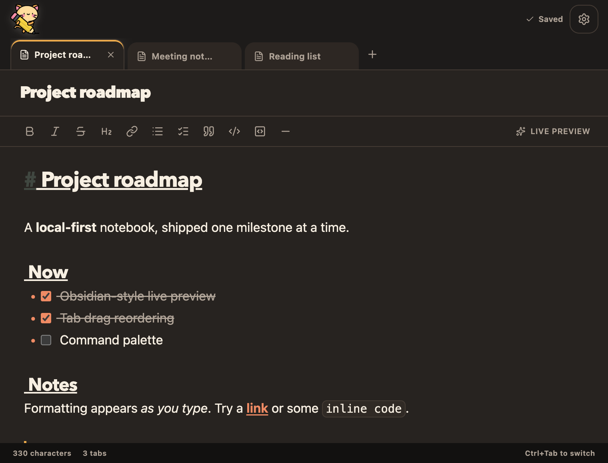
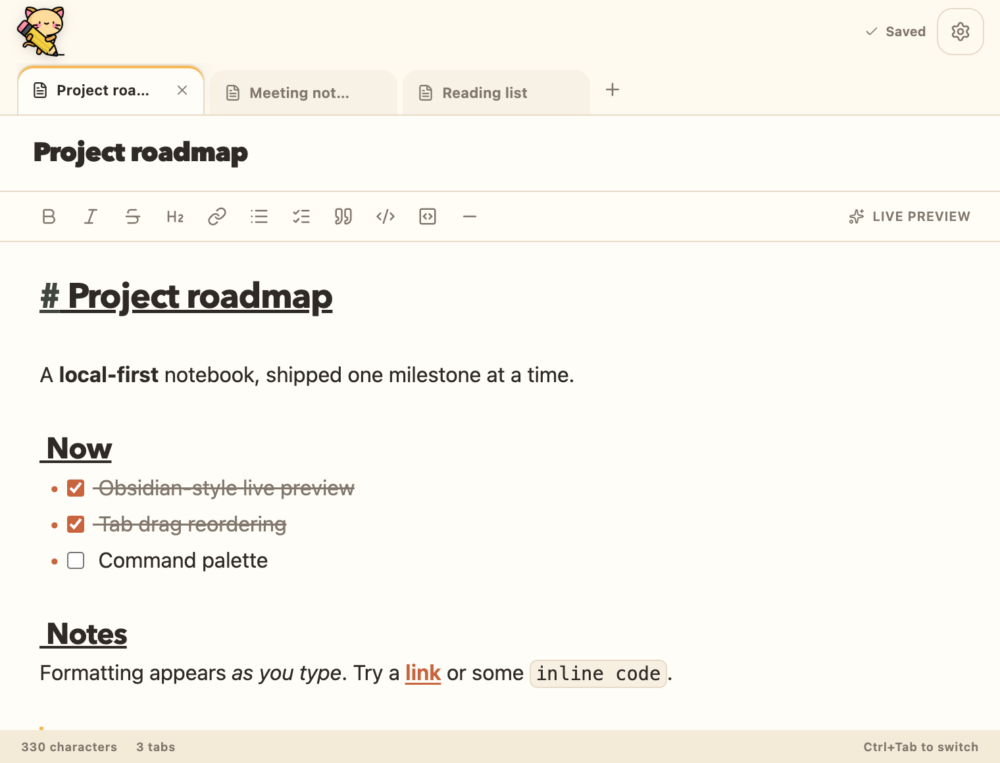
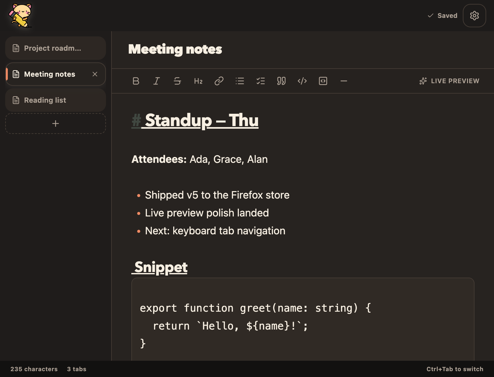
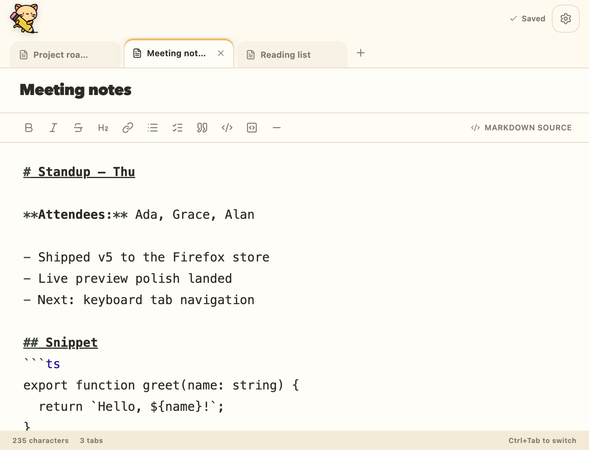

# TabbyNotes

A local-only, tabbed Markdown notebook for Chrome and Firefox.

TabbyNotes has no account, cloud sync, analytics, content scripts, or access to the pages you visit. Notes are saved as Markdown strings in the extension's local browser profile and can be imported or exported as `.md` files.

## Install

- **Firefox:** [Get TabbyNotes on Firefox Add-ons](https://addons.mozilla.org/en-US/firefox/addon/tabbynotes/)

## Screenshots

| Live preview (dark) | Live preview (light) |
| --- | --- |
|  |  |

| Vertical tab rail | Markdown source view |
| --- | --- |
|  |  |

## Highlights

- Obsidian-style live preview keeps Markdown formatted and editable in one surface, including tables, images and syntax-colored code blocks.
- Markdown syntax appears on the active line; a Source setting shows the raw document.
- Tabs can sit horizontally above the editor or in a vertical rail. Double-click a tab to rename it.
- Open TabbyNotes in the browser side panel or a resizable window when the toolbar popup feels cramped. While the window is open, the toolbar button brings it forward instead of opening the popup. Open copies stay in sync; if two copies edit the same note at once, the later edit wins.
- Ctrl/⌘ P jumps to any note, Ctrl/⌘ F finds and replaces, and Alt+Shift+N opens TabbyNotes. Settings lists every shortcut.
- Closed tabs can be restored with Undo or Ctrl/⌘ Shift T.
- Markdown import/export, plus JSON backups that restore every tab exactly.
- Light and dark themes.

## Permissions

TabbyNotes asks for no permissions in Firefox. In Chrome it requests only `sidePanel`, which shows no install warning. Images from the web wait for a click before loading (a setting can load them automatically), and are fetched without a referrer.

## Toolchain

- Bun 1.4.2 (Rust runtime)
- TypeScript 7 (native Go compiler)
- WXT and React 19
- Tailwind CSS 4
- CodeMirror 6
- Vitest

Install Bun 1.4.2 or newer from the stable channel, then install dependencies:

```sh
bun upgrade --stable
bun install
```

## Development

```sh
bun run dev
bun run dev:firefox
```

## Verification

```sh
bun run typecheck
bun run test
bun run build
bun run build:firefox
```

`bun run typecheck` invokes the Go-based TypeScript 7 `tsc` compiler. WXT builds Chrome and Firefox Manifest V3 packages from the same source.

## Privacy and persistence

The extension requests no permissions. Notes are persisted through the extension page's standard `localStorage`; this data is local to the browser profile and is removed when the extension is uninstalled. Existing v4 data under the `saveState` key is migrated on first launch and retained as a recovery backup.

## Credits

The TabbyNotes icon is a cat icon from Flaticon, used under its [Free License](https://www.flaticon.com/legal) (attribution required):

<a href="https://www.flaticon.com/free-icons/cat" title="cat icons">Cat icons created by Magnific - Flaticon</a>
